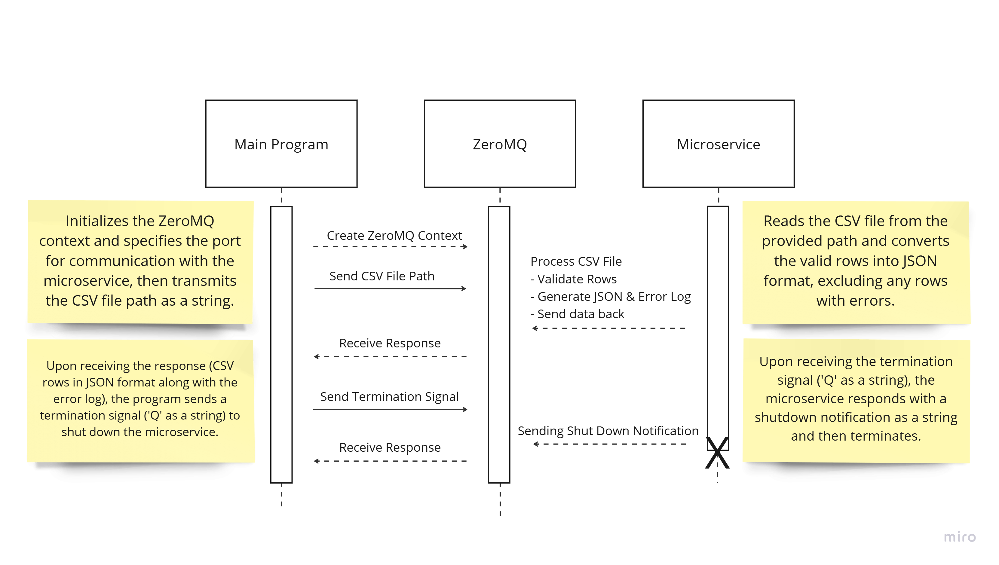

# CSV to JSON Converter

This microservice processes a CSV file containing credit card transactions. Upon receiving the file path from the main program, it performs the following tasks:

1. **JSON File Creation**: Converts the entire CSV data into a JSON file and saves it in the same directory as the CSV file.
2. **Error Log Generation**: Creates a text file listing all errors in the CSV, including their location (row and column), to help identify and resolve issues.
3. **Response to Main Program**: Sends the file paths of the generated JSON file and error log back to the main program for further processing or review.

---

## Goals

The microservice must:
- Receive a CSV file path.
- Read and validate the file data to identify incorrect entries.
- Create a JSON file to save the processed information.

---

## User Stories

### **1. Import and Prepare Data**
As a user, I want to read a CSV file containing financial transactions so that the microservice can process and prepare it for analysis.

**<u>Acceptance Criteria</u>**:
  - **Functional Requirement**: Given a valid path to a CSV file, when the main program initiates a read operation, the microservice should process the file and prepare it for conversion.
  - **Quality Attribute**: Reliability
  - **Non-functional Requirement**: The microservice should handle file imports with a 99% success rate, reliably identifying and processing rows.

### **2. Data Validation and Conversion**
As a user, I want the microservice to validate and convert my CSV data to JSON format so that I have consistent data with errors identified.

**<u>Acceptance Criteria**</u>:
  - **Functional Requirement**: Given the CSV file contains some invalid rows, when the data is read, the microservice should validate each entry, convert valid rows to JSON, and log any errors or skipped rows.
  - **Quality Attribute**: Data Integrity
  - **Non-functional Requirement**: The microservice must maintain data accuracy during validation and conversion, skipping any row with missing or malformed entries.

### **3. Export Converted Data**
As a user, I want the microservice to export my converted data in JSON format so that the main program can use it for further analysis and display.

**<u>Acceptance Criteria</u>**:
  - **Functional Requirement**: Given the JSON conversion is complete, when the JSON data is ready, the microservice should send the data to the main program along with a summary of skipped rows.
  - **Quality Attribute**: Efficiency
  - **Non-functional Requirement**: The microservice should convert and export data in under 3 seconds for files with up to 500 transactions.

---

## Request Parameters

- **`file_path` (string)**: The path to the CSV file containing transaction data. This path will be passed by the main program to the microservice, which will read the file, process it, and return JSON data.

---

## Communication Contract

A. Instructions for **how to programmatically REQUEST data** from the microservice:

To request data, the main program sends the absolute path to the CSV file to the microservice using ZeroMQ. The file path must be a valid string.

<u>Example Request:</u> 

```
socket.send_string(r'C:\Path\Transactions.csv
```

B. Instructions for **how to programmatically RECEIVE data** from the microservice:

To receive data, the main program listens for the microservice's response using ZeroMQ. The response will indicate success or error, along with file paths if successful.

<u>Example Response:</u>

```
Status: Success!
Files:
JSON File: C:\Path\Data.json
Error Log: C:\Path\ErrorLog.txt
```

C. **UML Sequence Diagram**


